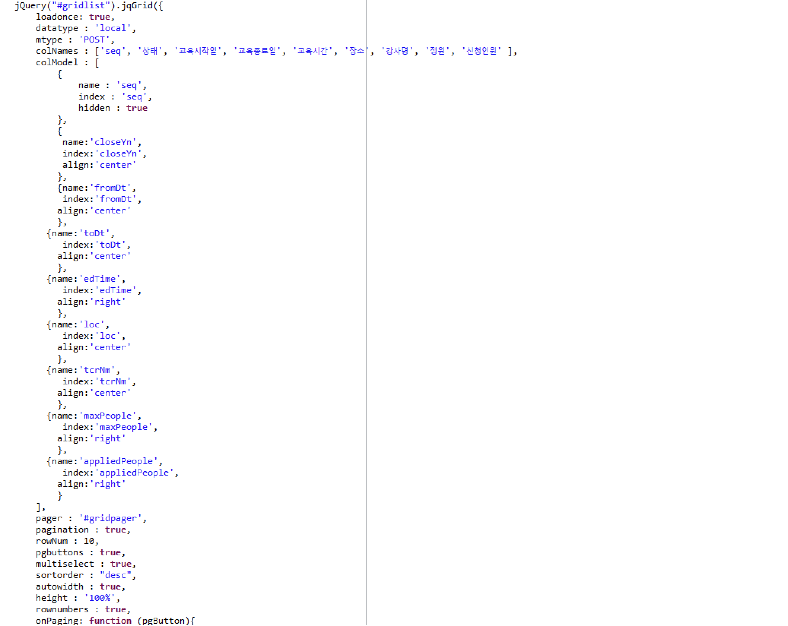
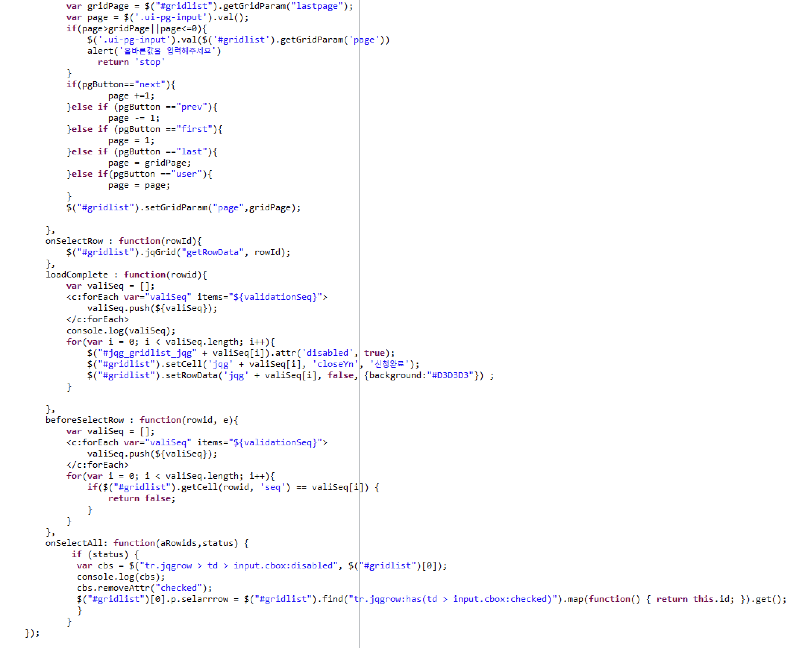
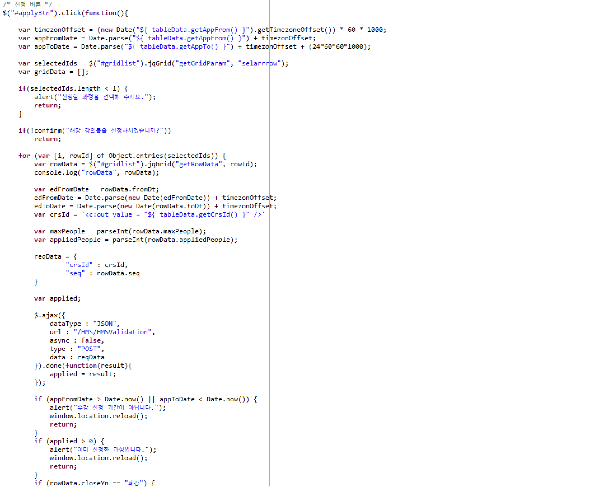
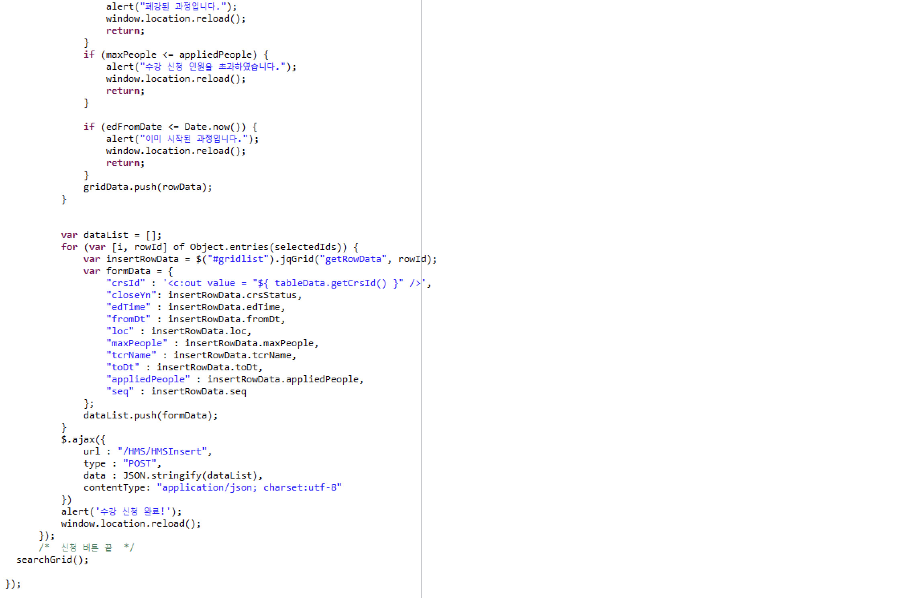

1.프로젝트 소개
================
***
: 프로젝트는 1월 5일 부터 1월 28일까지 진행하였습니다. 프로젝트는 인턴 교육용으로 진행하였습니다.</br>
이 프로젝트는 사내 수강신청 시스템이라는 컨셉을 갖고 있었으며, 사용자는 Admin, Teacher, Student 
3가지 Role로 구분되었습니다.</br> 간단한 프로세스는 다음과 같습니다.</br>

1. 강사는 수강 과목을 등록 요청할 수 있습니다.
2. 교육담당자는 과목을 확인하고, 필요에 따라 해당 과목을 등록 확정, 종료, 폐강 등의 과정 상태를 정할 수 있습니다.
3. 수강생은 교육담당자가 등록 확정한 과목을 수강신청 할 수 있습니다.

***
```
프로세스에서는 다음과 같은 요구사항이 존재하였습니다.
1. 교육과정은 강사가 직접 등록하며, 교육담당자가 승인 후 교육이 가능하다
2. 교육담당자는 강사가 등록한 과정을 검토하며, 교육을 등록하거나 종료시킬 수 있다.
3. 1개의 교육 과정은 여러 차수로 나누어 교육할 수 있다.
4. 교육 시작 하루 전까지만 수강신청이 가능하며 당일 교육에 대해서는 불가능하다
5. 교육은 신청인원이 작으면 폐강 처리 할 수 있다.
6. 외부 교육의 경우, 원하는 교육기관이 없으면 과정 등록시 신규 등록이 가능하다.
7. 수강자는 신청 가능 목록조회에 가서 수강신청을 한다. 교육 담당자가 확정한 교육 과정만 조회된다.
8. 신청 가능 강좌 목록은 엑셀로 다운로드가 가능하다.
9. 원하는 교육 과정을 선택 후, 수강 신청을 할 수 있다. 단, 아래의 경우는 불가능하다.
   1. 정원 대비 신청인원이 가득 찬 경우
   2. 교육이 이미 시작된 경우
   3. 수강 신청 기간에 포함되지 않는 경우
   4. 이미 신청한 과정인 경우
10. 교육 신청에 대해서 특정 사유로 수강 불가할 경우 신청 취소가 가능해야한다.
11. 교육 신청, 취소 내역은 모두 신청내역에서 확인할 수 있어야 한다.
```
2.프로젝트 간 맡은 역할
==================
***
 : 저는 프로젝트에서 '수강 신청'을 맡았습니다. 이 시스템을 구축하기 위해 JQuery, jqGrid, JSP, Spring, MyBatis, HeidiSQL을 이용하였습니다.
또한, 다음과 같은 계획을 갖고, 시스템을 차근차근 구축해나가기 시작하였습니다.
##### 1. 데이터 접근을 위한 Query문 작성.

```
<?xml version="1.0" encoding="UTF-8"?>
<!DOCTYPE mapper PUBLIC "-//mybatis.org//DTD Mapper 3.0//EN" "http://mybatis.org/dtd/mybatis-3-mapper.dtd">
<mapper namespace = "com.example.prj.serveSocket.HMS.repository.mapper.CourseApplyMapper">
    <select id = "selectTableAll" resultType = "TableVO" parameterType = "String">
        select crs_id, crs_nm,
        (select C.common_code_name from common_code C where C.class_code = 'bhr_ed_crs_status' and C.common_code = M.crs_status) as crs_status,
        (select C.common_code_name from common_code C where C.class_code = 'bhr_ed_fld' and C.common_code = M.ed_fld) as ed_fld,
        ed_site,
        (select C.common_code_name from common_code C where C.class_code = 'bhr_ed_type' and C.common_code = M.ed_type) as ed_type,
        (select C.common_code_name from common_code C where C.class_code = 'bhr_ed_io' and C.common_code = M.io) as io,
        app_from,
        app_to,
        from hr_ed_crs_m M
        where M.crs_id = #{ crs_id }
    </select>

    <select id = "selectGridAll" resultType = "GridVO" parameterType = "String">
        select D.seq,
                case D.close_yn
                    when 'Y' then '폐강'
                    when 'N' then '수강가능'
                end as close_yn
                , loc
                , from_dt
                , ed_time
                , tcr_nm
                , max_people
                , (
                    select(
                            count(case when A.app_status = 'A' then 1 end))
                            from hr_ed_app A
                            where A.crs_id = D.crs_id
                            and A.seq = D.seq
                    ) applied_people
                from hr_ed_crs_d D
                where crs_id = #{ crs_id }
                and D.close_yn = 'N'
                order by from_dt asc
    </select>

    <select id = "selectTextAll" resultType = "TextVO" parameterType = "String">
        select ed_trgt, ed_purpose, ed_cont
        from hr_ed_crs_m
        where crs_id = #{ crs_id }
    </select>

    <select id = "validationIns" resultType = "int" parameterType = "ValidationVO">
        select count(*)
        from hr_ed_app ap
        where ap.crs_id = #{ crsId }
        and ap.emp_id = (select id from tb_user where usr_name = #{ userName })
        and ap.app_status = 'A'
        and seq = #{ seq}
    </select>

    <select id = "validation" resultType = "int" parameterType ="String">
        select seq as validationGrid
        from hr_ed_app
        where app_status = 'A'
        and crs_id = #{ crs_id }
        and emp_id = (
                        select id
                        from tb_user
                        where usr_name = #{ username }
                      )
    </select>

    <insert id = "insertApplyInfo" parameterType = "String">
        insert into hr_ed_app(
                                app_seq
                                , crs_id
                                , app_status
                                , seq
                                , emp_id
                                , cancel
                                , crt_dt
                                , updt_dt
                            )
        values(
                (select ifnull(max(app_seq), 0) from hr_ed_app sub) + 1,
                'A',
                #{ crs_id },
                #{ seq },
                #{ user_id },
                'N',
                #{ user_id },
                date_format(now(), '%Y%m%d%H%i%s'),
                date_format(now(), '%Y%m%d%H%i%s')
        )
    </insert>
</mapper>
```
***
##### 2. Repository  구성
```java
public class ApplInfoVO // Insert(수강신청)
    private int appSeq;
    private int crsId;
    private int seq;
    private String appStatus;
    private String userName;

    private String cancel;
    private String cancelRsn;
    private int crtId;
    private String crtDt;
    private int updtId;
    private String updtDt;

    public ApplInfoVO(int appSeq, int crsId, int seq, String appStatus, String userName, String cancel, String cancelRsn, int crtId, String crtDt, int updtId, String updtDt) {
        this.appSeq = appSeq;
        this.crsId = crsId;
        this.seq = seq;
        this.appStatus = appStatus;
        this.userName = userName;
        this.cancel = cancel;
        this.cancelRsn = cancelRsn;
        this.crtId = crtId;
        this.crtDt = crtDt;
        this.updtId = updtId;
        this.updtDt = updtDt;
    }
```
```java
public class GridVO // jqGrid에 출력을 위한 VO
    private int rnum;
    private String crsId;
    private String closeYn;
    private String fromDt;
    private String toDt;
    private int edTime;
    private String loc;
    private String tcrNm;
    private int maxPeople;
    private int appliedPeople;
    private String seq;
    private String validationSeq;

    public GridVO(int rnum, String crsId, String closeYn, String fromDt, String toDt, int edTime, String loc, String tcrNm, int maxPeople, int appliedPeople, String seq, String validationSeq) {
        this.rnum = rnum;
        this.crsId = crsId;
        this.closeYn = closeYn;
        this.fromDt = fromDt;
        this.toDt = toDt;
        this.edTime = edTime;
        this.loc = loc;
        this.tcrNm = tcrNm;
        this.maxPeople = maxPeople;
        this.appliedPeople = appliedPeople;
        this.seq = seq;
        this.validationSeq = validationSeq;
    }
```

```java
public class TableVO // Table 
    private String crsId;
    private String crsNm;
    private String edStie;
    private String edFld;
    private String edType;
    private String appFrom;
    private String appTo;
    private String crsStatus;
    private String io;
```

```java
public class ValidationVO // For Validation
    private String crsId;
    private String seq;
    private String userName;
```

***
####3.Service의 구성
```java
public class ApplyService {
    @Autowired
    private com.example.prj.serveSocket.HMS.repository.mapper.CourseApplyMapper myMapper;

    public List<GridVO> selectGridAll(String crs_id, String username){
        return myMapper.selectGridAll(crs_id, username);
    }

    public TextVO selectTextAll(String crs_id){
        return myMapper.selectTextAll(crs_id);
    }

    public TableVO selectTableAll(String crs_id){
        return myMapper.selectTableAll(crs_id);
    }

    public int validationIns(ValidationVO vo){
        return myMapper.validationIns(vo);
    }

    public int insertApplyInfo(String crs_id, String user_id, String seq){
        return myMapper.insertApplyInfo(crs_id, user_id, seq);
    }

    public List<Integer> validation(String crs_id, String username){
        return myMapper.validation(crs_id, username);
    }
}
```
***
####4.Controller의 구성
```java
@Controller
public class CourseController {
    @Autowired
    ApplyService hmsService;

    @GetMapping("/student/courseapply")
    public ModelAndView myView(HttpServletRequest request, HttpSession session){
        ModelAndView view = new ModelAndView();
        UserVO userInfo = (UserVO) session.getAttribute(User.USER);
        if(userInfo.getRole() == 6 || userInfo.getRole() == 7){
            return new ModelAndView("redirect:/main");
        }

        String crsid = request.getQueryString();

        TableVO tableData = hmsService.selectTableAll(crsid);

        List<GridVO> gridData = hmsService.selectGridAll(crsid, userInfo.getUsername());
        TextVO textData = hmsService.selectTextAll(crsid);
        List<Integer> list = hmsService.validation(crsid, userInfo.getUsername());
        view.addObject("tableData", tableData);
        view.addObject("gridData", gridData);
        view.addObject("textData", textData);
        view.addObject("crs_id", crsid);
        view.addObject("validationSeq", list);
        view.setViewName("/HMS/courseapply");
        return view;
    }

    @RequestMapping(value = "/HMS/HMSGrid", method = RequestMethod.POST)
    public @ResponseBody Object jqList(@RequestParam(value = "crs_id") int crs_id,
                                       HttpServletRequest request, HttpSession session
                                       ) throws JsonProcessingException{
        UserVO userInfo = (UserVO) session.getAttribute(User.USER);
        List<GridVO> gridData = hmsService.selectGridAll(Integer.toString(crs_id), userInfo.getUsername());
        Map<String, Object> modelMap = new HashMap<String, Object>();
        modelMap.put("rows", gridData);

        ObjectMapper mapper = new ObjectMapper();
        String value = mapper.writeValueAsString(modelMap);
        return value;
    }

    @RequestMapping("/HMS/HMSValidation")
    public @ResponseBody int Validation(GridVO vo. HttpServletRequest request, HttpSession session){
        UserVO userInfo = (UserVO) session.getAttribute(User.USER);
        ValidationVO vvo = new ValidationVO(vo.getCrsId(), vo.getSeq(), userInfo.getUsername());
        int count = hmsService.validationIns(vvo);
        return count;
    }

    @RequestMapping(value="/HMS/HMSInsert", method = RequestMethod.POST)
    public @ResponseBody void InsertData(HttpSession session,
                                         @Valid
                                         @RequestBody List<GridVO> data,
                                         HttpServletRequest request
                                         ){
        UserVO userInfo = (UserVO) session.getAttribute(User.USER);
        for(int i = 0; i < data.size(); i++){
            String crsId = data.get(i).getCrsId();
            String userId = Integer.toString(userInfo.getUserId());
            String seq = data.get(i).getSeq();
            ValidationVO vo = new ValidationVO(data.get(i).getCrsId(), data.get(i).getSeq(), userInfo.getUsername());
            int count = hmsService.validationIns(vo);
            if(count >= 1){
                return;
            } else {
                hmsService.insertApplyInfo(crsId, userId, seq);
            }
        }
    }

}
```
####5. JSP 구성 
: JSP에서는 주로 AJAX를 이용하여 Controller 요청을 하였습니다. jqGrid의 페이지네이션,
beforeSelectRow 속성을 통하여 신청 차수에 대해 선택이 불가능, onSelectAll 속성을 통하여 
Check Box All 접근 차단, ValidationVO를 통한 View의 Validation, Controller의 Validation 등
유효값 검증에 힘썼습니다. 따라서, 위에 언급된 '수강 신청에 대한 요구사항'을 충족할 수 있었습니다.




***
#최종 결과물

#Validation

***

3.이번 프로젝트 간 배운 점
=====================
: 처음엔 막연히 스프링을 접하였습니다. MVC가 무엇인지, Servlet이 무엇인지, 요청 / 응답이 무엇인지, 
AJAX는 또 무엇이며, 심지어 JavaScript에서 함수조차 구현하지 못하여 멘토님 앞에서 당혹스러웠습니다. 
하지만, 팀원과 구성원을 통하여 매우 많은 가르침을 얻을 수 있었습니다. 처음에 팀원에게 console.log를 어떻게 찍는지,
또한 Controller에서 sout은 어떻게 하는지 물어본 기억이 아직도 생생합니다. 점점 프로젝트에서 팀원과 멘토님에게
막히는 것들을 물어보며 막히는 것들을 하나하나 해결해 나갔던 것 같습니다. 
모르는 것들을 잘 알려준 팀원들과 멘토님에게 다시 한번, 감사를 표하고 싶습니다. 