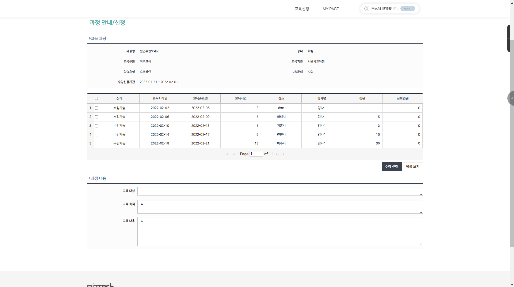
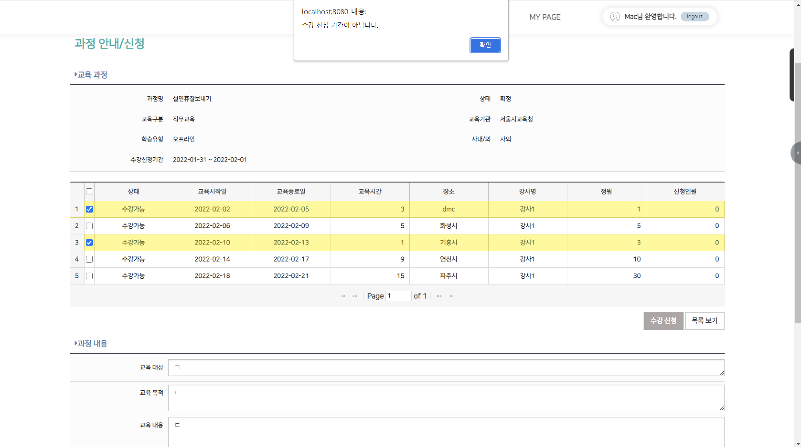

1.프로젝트 소개
================
***
: 프로젝트는 1월 5일 부터 1월 28일까지 진행하였습니다. 프로젝트는 인턴 교육용으로 진행하였습니다.</br>
이 프로젝트는 사내 수강신청 시스템이라는 컨셉을 갖고 있었으며, 사용자는 Admin, Teacher, Student 
3가지 Role로 구분되었습니다.</br> 간단한 프로세스는 다음과 같습니다.</br>

1. 강사는 수강 과목을 등록 요청할 수 있습니다.
2. 교육담당자는 과목을 확인하고, 필요에 따라 해당 과목을 등록 확정, 종료, 폐강 등의 과정 상태를 정할 수 있습니다.
3. 수강생은 교육담당자가 등록 확정한 과목을 수강신청 할 수 있습니다.

***
```
프로세스에서는 다음과 같은 요구사항이 존재하였습니다.
1. 교육과정은 강사가 직접 등록하며, 교육담당자가 승인 후 교육이 가능하다
2. 교육담당자는 강사가 등록한 과정을 검토하며, 교육을 등록하거나 종료시킬 수 있다.
3. 1개의 교육 과정은 여러 차수로 나누어 교육할 수 있다.
4. 교육 시작 하루 전까지만 수강신청이 가능하며 당일 교육에 대해서는 불가능하다
5. 교육은 신청인원이 작으면 폐강 처리 할 수 있다.
6. 외부 교육의 경우, 원하는 교육기관이 없으면 과정 등록시 신규 등록이 가능하다.
7. 수강자는 신청 가능 목록조회에 가서 수강신청을 한다. 교육 담당자가 확정한 교육 과정만 조회된다.
8. 신청 가능 강좌 목록은 엑셀로 다운로드가 가능하다.
9. 원하는 교육 과정을 선택 후, 수강 신청을 할 수 있다. 단, 아래의 경우는 불가능하다.
   1. 정원 대비 신청인원이 가득 찬 경우
   2. 교육이 이미 시작된 경우
   3. 수강 신청 기간에 포함되지 않는 경우
   4. 이미 신청한 과정인 경우
10. 교육 신청에 대해서 특정 사유로 수강 불가할 경우 신청 취소가 가능해야한다.
11. 교육 신청, 취소 내역은 모두 신청내역에서 확인할 수 있어야 한다.
```
2.프로젝트 간 맡은 역할
==================
***
 : 저는 프로젝트에서 '수강 신청'을 맡았습니다. 이 시스템을 구축하기 위해 JQuery, jqGrid, JSP, Spring, MyBatis, HeidiSQL을 이용하였습니다.
또한, 다음과 같은 계획을 갖고, 시스템을 차근차근 구축해나가기 시작하였습니다.
##### 1. 데이터 접근을 위한 Query문 작성.
***
#### 2. Repository  구성
***
#### 3.Service의 구성
***
#### 4.Controller의 구성
#### 5. JSP 구성 
: JSP에서는 주로 AJAX를 이용하여 Controller 요청을 하였습니다. jqGrid의 페이지네이션,
beforeSelectRow 속성을 통하여 신청 차수에 대해 선택이 불가능, onSelectAll 속성을 통하여 
Check Box All 접근 차단, ValidationVO를 통한 View의 Validation, Controller의 Validation 등
유효값 검증에 힘썼습니다. 따라서, 위에 언급된 '수강 신청에 대한 요구사항'을 충족할 수 있었습니다.
***
# <span style = "color:#2D3748; background-color:#fff5b1;">최종 결과물</span>

# <span style = "color:#2D3748; background-color:#fff5b1;">Validation</span>

***
3.이번 프로젝트 간 배운 점
=====================
: 처음엔 막연히 스프링을 접하였습니다. MVC가 무엇인지, Servlet이 무엇인지, 요청 / 응답이 무엇인지, 
AJAX는 또 무엇이며, 심지어 JavaScript에서 함수조차 구현하지 못하여 멘토님 앞에서 당혹스러웠습니다. 
하지만, 팀원과 구성원을 통하여 매우 많은 가르침을 얻을 수 있었습니다. 처음에 팀원에게 console.log를 어떻게 찍는지,
또한 Controller에서 sout은 어떻게 하는지 물어본 기억이 아직도 생생합니다. 점점 프로젝트에서 팀원과 멘토님에게
막히는 것들을 물어보며 막히는 것들을 하나하나 해결해 나갔던 것 같습니다. 
모르는 것들을 잘 알려준 팀원들과 멘토님에게 다시 한번, 감사를 표하고 싶습니다. 
